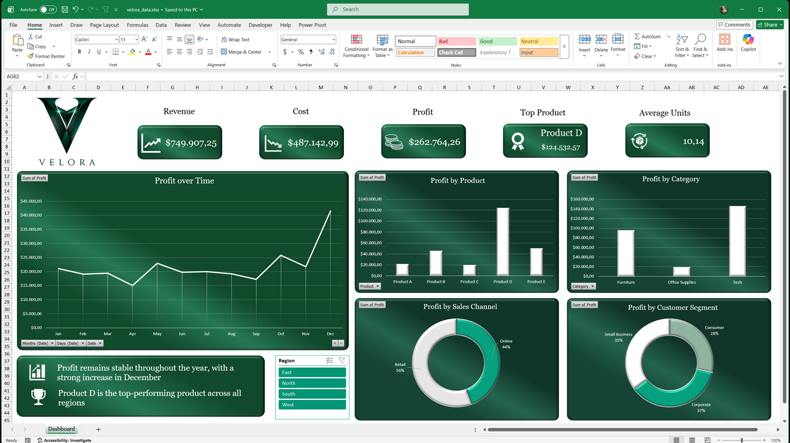
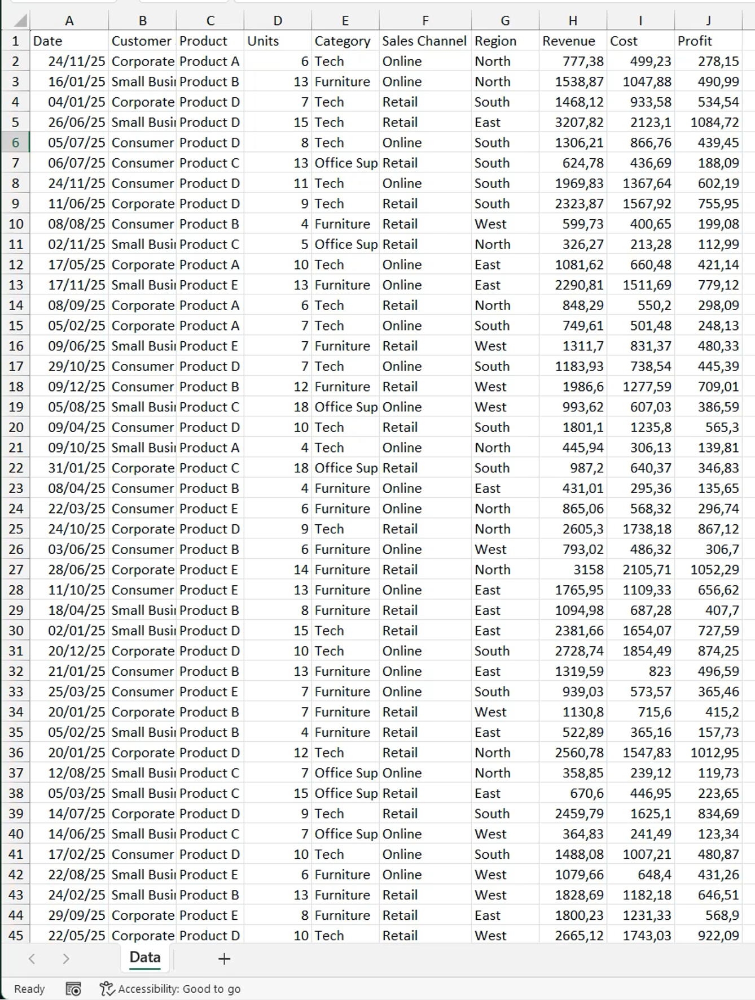
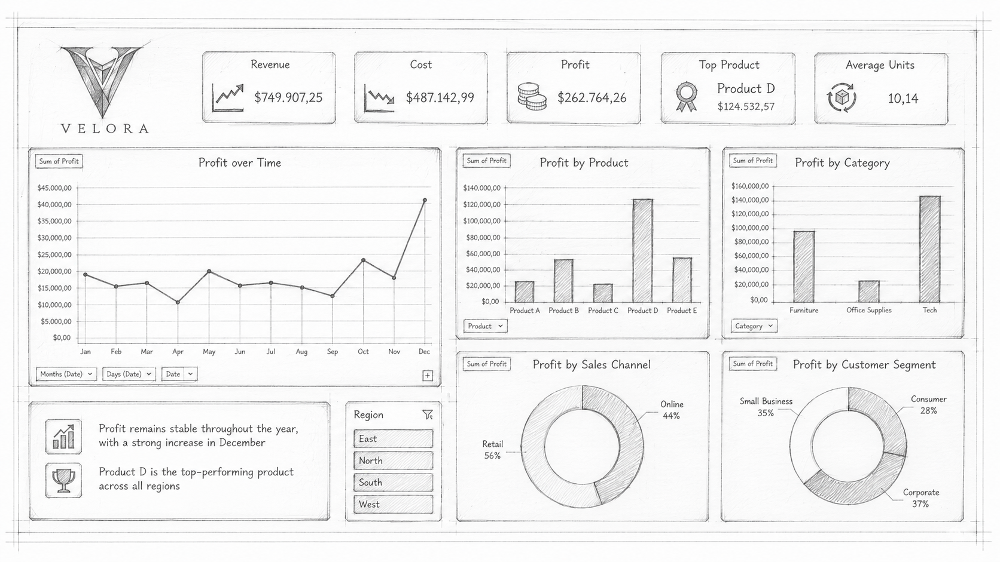

# Velora Excel Dashboard

**An interactive Excel dashboard created to analyse profit and business performance for a fictional retail company.**

## Dashboard Preview

## Project Overview

Velora is a fictional premium retail company selling technology products, furniture, and office supplies.

The dashboard was created to analyse profit across different products, categories, regions, sales channels, and customer segments.

## From Data to Dashboard

The project started with a structured dataset containing revenue, cost, products, regions, categories, and customer information.

A Profit column was calculated using:

`Profit = Revenue - Cost`

### Source Data

### Dashboard Sketch

## Dashboard Features

- Revenue, Cost, Profit, Average Units, and Top Product KPIs
- Region slicer
- Profit analysis by month
- Profit by product and category
- Profit by sales channel and customer segment
- Interactive PivotCharts

## Files Included

| File | Description |
|---|---|
| `excel-dashboard.xlsx` | Completed Excel dashboard |
| `dashboard-image.png` | Final dashboard preview |
| `dashboard-sketch.png` | Initial dashboard sketch |
| `data.png` | Source data preview |
| `README.md` | Project information |

## How to Download and Use

1. Download `excel-dashboard.xlsx`.
2. Open it with Microsoft Excel.
3. Go to the Dashboard worksheet.
4. Use the Region slicer to explore the results.

[Download the Excel Dashboard](excel-dashboard.xlsx)

## Tools and Skills

- Microsoft Excel
- PivotTables
- PivotCharts
- Slicers
- Excel formulas
- Dashboard design
